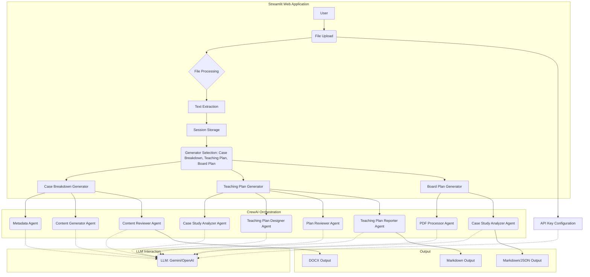

# Case Study Analysis Suite - README

This project provides a comprehensive suite of tools for analyzing case studies, designed to assist educators and business professionals in extracting key insights, creating teaching materials, and generating structured analyses. The application is built using Streamlit for the user interface, CrewAI for agent orchestration, and supports both Google Gemini and OpenAI for language model capabilities.

## Table of Contents

1.  [Introduction](#introduction)
2.  [Features](#features)
3.  [Architecture Overview](#architecture-overview)
    *   [System Diagram](#system-diagram)
    *   [Component Breakdown](#component-breakdown)
4.  [Agent Descriptions](#agent-descriptions)
    *   [Case Breakdown Generator Agents](#case-breakdown-generator-agents)
    *   [Teaching Plan Generator Agents](#teaching-plan-generator-agents)
    *   [Board Plan Generator Agents](#board-plan-generator-agents)
5.  [Installation and Setup](#installation-and-setup)
    *   [Prerequisites](#prerequisites)
    *   [Installation Steps](#installation-steps)
    *   [API Key Configuration](#api-key-configuration)
6.  [Usage Guide](#usage-guide)
    *   [File Upload](#file-upload)
    *   [Case Breakdown Generator](#case-breakdown-generator)
    *   [Teaching Plan Generator](#teaching-plan-generator)
    *   [Board Plan Generator](#board-plan-generator)
    *   [Session Reset](#session-reset)
7.  [Code Structure](#code-structure)
    *   [Utility Functions](#utility-functions)
    *   [Document Generator (Case Breakdown)](#document-generator-case-breakdown)
    *   [Case Breakdown Generator](#case-breakdown-generator-1)
    *   [Teaching Plan Generator](#teaching-plan-generator-1)
    *   [Board Plan Generator](#board-plan-generator-1)
    *   [Main App Interface](#main-app-interface)
8.  [Dependencies](#dependencies)
9.  [Troubleshooting](#troubleshooting)
10. [Contributing](#contributing)
11. [License](#license)
12. [Future Enhancements](#future-enhancements)
13. [Author](#author)

## 1. Introduction

The Case Study Analysis Suite is designed to streamline the process of analyzing business case studies and generating various types of related documents. It leverages the power of AI to automate many of the tedious tasks involved in dissecting case studies, creating teaching materials, and preparing board-level analyses.  The suite supports multiple file formats (PDF, DOCX, PPT, PPTX) and provides downloadable outputs in relevant formats (DOCX, Markdown).

## 2. Features

*   **Case Breakdown Generator:**
    *   Automatically extracts metadata (title, author) from the case study.
    *   Generates a comprehensive Word document (.docx) with predefined sections: Synopsis, Learning Objectives, Teaching Strategies, Suggested Teaching Plan, Key Points, Further Insights, Discussion Questions & Answers, Assignment Exercises, Automated Conversation, and Case Suggestions.
    *   Provides content review and scoring for each section.
    *   Offers a structured, formatted, and customizable output.

*   **Teaching Plan Generator:**
    *   Creates a detailed 2-hour teaching plan based on the uploaded case study.
    *   Includes sections for objectives, introduction, detailed lesson breakdowns, visual aids, assessments, and conclusion.
    *   Provides feedback and iterative refinement of the teaching plan.
    *   Outputs a Markdown (.md) file for easy editing and use.

*   **Board Plan Generator:**
    *   Analyzes the case study and creates a structured board plan suitable for presentations.
    *   Identifies key concepts, industry suitability, benefits, implementation details, and risk assessment.
    *   Outputs a structured JSON and presents it in a user-friendly way.  Generates a Markdown (.md) file for download.

*   **File Handling:**
    *   Supports multiple file uploads (PDF, DOCX, PPT, PPTX).
    *   Combines text from multiple files for comprehensive analysis.
    *   Handles temporary file storage and cleanup.

*   **API Key Management:**
    *   Supports both Google Gemini and OpenAI API keys.
    *   Allows users to switch between providers.
    *   Provides clear instructions for key configuration.

*   **User Interface:**
    *   Intuitive Streamlit-based web interface.
    *   Tabbed layout for easy navigation between generators.
    *   Progress indicators and status updates during processing.
    *   Session reset functionality for starting fresh.

*   **Error Handling:**
     *   Handles different types of errors like API errors, file format errors, and analysis errors.
     *   Displays informative error messages to the user.
     *   Handles cases with encrypted pdf files.

## 3. Architecture Overview

### 3.1. System Diagram


## 3.2. Component Breakdown

*   **User Interface (Streamlit):**
    *   Handles file uploads, user input, and display of results.
    *   Provides a tabbed interface for selecting different generators.
    *   Manages session state to store uploaded files, extracted text, and generated outputs.

*   **File Processing:**
    *   Extracts text from various file formats (PDF, DOCX, PPTX).
    *   Combines text from multiple files into a single string.
    *   Creates temporary files for processing.

*   **CrewAI Orchestration:**
    *   Defines and manages agents (specialized AI workers).
    *   Assigns tasks to agents.
    *   Controls the workflow and communication between agents.
    *   Uses sequential process for most tasks.

*   **LLM Interaction (Gemini/OpenAI):**
    *   Provides the underlying language model capabilities.
    *   Agents interact with the LLM via API calls.
    *   Supports both Gemini and OpenAI models.

*   **Output:**
    *   Generates downloadable files in appropriate formats (DOCX, Markdown).
    *   Displays results within the Streamlit application.

## 4. Agent Descriptions

### 4.1. Case Breakdown Generator Agents

*   **Metadata Analyzer:**
    *   **Role:** Extracts title and author information.
    *   **Goal:** Identify key metadata from the document content.
    *   **Backstory:** Specializes in analyzing document content to find titles, authors, and publication information.
    *   **Tasks:** Analyzes extracted text, specifically the beginning, to identify title and author(s).

*   **Case Study Content Generator:**
    *   **Role:** Generates content for different sections of the case breakdown.
    *   **Goal:** Create comprehensive case analysis content based on section requirements.
    *   **Backstory:** Expert business analyst specializing in case study analysis and business education.
    *   **Tasks:** Generates content for each section (Synopsis, Objectives, etc.) based on the provided prompt and extracted text.

*   **Content Quality Reviewer:**
    *   **Role:** Evaluates and scores generated content.
    *   **Goal:** Provide feedback on quality, relevance, and depth of analysis.
    *   **Backstory:** Seasoned academic reviewer with experience in evaluating business case studies.
    *   **Tasks:** Reviews each generated section, provides a numerical score (1-10), identifies strengths, and suggests improvements.

### 4.2. Teaching Plan Generator Agents

*   **Case Study Analyzer:**
    *   **Role:** Analyzes case study files.
    *   **Goal:** Extract key concepts, objectives, and data.
    *   **Backstory:** Expert in analyzing business case studies to identify core themes and learning objectives.
    *   **Tools:** `extract_text` (custom tool to extract text from files).
    *   **Tasks:** Extracts and summarizes key concepts and learning objectives from the uploaded files.

*   **Teaching Plan Designer:**
    *   **Role:** Designs the 2-hour lesson plan.
    *   **Goal:** Create a structured lesson plan based on the analyzed case study.
    *   **Backstory:** Educator specializing in designing lesson plans.
    *   **Tasks:** Creates a detailed 2-hour lesson plan with sections for introduction, analysis, activities, and assessment.

*   **Plan Reviewer:**
    *   **Role:** Reviews the generated lesson plan.
    *   **Goal:** Ensure clarity, alignment with objectives, and engagement.
    *   **Backstory:** Curriculum reviewer verifying plan quality.
    *   **Tasks:** Provides feedback on the plan's clarity, alignment, and engagement level.

*   **Teaching Plan Reporter:**
     *   **Role:** Finalizes the teaching plan content.
     *   **Goal:** Incorporate feedback and finalize the plan.
     *   **Backstory:** Experienced educator with expertise in curriculum development.
     *   **Tasks:** Revises the plan based on reviewer feedback, ensuring clarity, conciseness, and a structured format.

### 4.3. Board Plan Generator Agents

*   **PDF Processor:**
    *   **Role:** Extracts and cleans text from PDF documents.
    *   **Goal:** Prepare the text content for analysis.
    *   **Backstory:** Expert in processing PDF documents.
    *   **Tools:** `extract_text_from_pdf` (function to extract text from PDFs).
    *   **Tasks:** Extracts and cleans the text, ensuring it's properly formatted.

*   **Case Study Analyzer:**
    *   **Role:** Analyzes the case study content.
    *   **Goal:** Identify key points for the board plan.
    *   **Backstory:** Expert business analyst skilled in creating structured analyses.
    *   **Tools:** `analyze_case_study` (function using litellm for JSON-formatted analysis).
    *   **Tasks:** Analyzes the text and creates a structured board plan with sections like main concept, industry suitability, benefits, implementation details, and risk assessment.  Returns the analysis as a JSON object.

## 5. Installation and Setup

### 5.1. Prerequisites

*   Python 3.8 or higher
*   pip (Python package installer)
*   A Google Gemini API key or an OpenAI API key

### 5.2. Installation Steps

1.  **Clone the repository:**

    ```bash
    git clone https://github.com/kashyaparun25/Case-Analysis-Suite-3-in-1.git  # Replace with your repository URL
    cd Case-Analysis-Suite-3-in-1
    ```

2.  **Create a virtual environment (recommended):**

    ```bash
    python3 -m venv venv
    source venv/bin/activate  # On Windows: venv\Scripts\activate
    ```

3.  **Install dependencies:**

    ```bash
    pip install -r requirements.txt
    ```
    (Create a `requirements.txt` file with all necessary libraries: `streamlit`, `python-docx`, `PyPDF2`, `pptx`, `docx2txt`, `crewai`, `pydantic`, `litellm`, `python-dotenv`)

### 5.3. API Key Configuration

1.  **Create a `.env` file:**  In the root directory of the project, create a file named `.env`.

2.  **Add your API keys:**
    *   For Google Gemini:
        ```
        GEMINI_API_KEY=your_gemini_api_key
        ```
    *   For OpenAI:
        ```
        OPENAI_API_KEY=your_openai_api_key
        ```
    Replace `your_gemini_api_key` and `your_openai_api_key` with your actual API keys.

## 6. Usage Guide

1.  **Run the Streamlit app:**

    ```bash
    streamlit run app.py  # Replace 'app.py' with the actual filename
    ```
    This will open the application in your web browser.

### 6.1. File Upload

*   Click the "Browse files" button in the main area (or drag and drop files).
*   Select one or more case study files (PDF, DOCX, PPT, PPTX).
*   The application will process the files and display a success message.

### 6.2. Case Breakdown Generator

1.  Select the "Case Breakdown Generator" tab.
2.  If you haven't entered an API key, do so in the sidebar.
3.  The application automatically extracts the title and author.  You can edit these fields.
4.  Click the "Generate Case Breakdown" button.
5.  Wait for the generation process to complete (this may take several minutes).  Progress indicators will be displayed.
6.  Two tabs will appear: "Generated Content" and "Content Review".
7.  Review the generated content and the associated reviews.
8.  Click the "Download Case Breakdown (DOCX)" button to download the formatted document.

### 6.3. Teaching Plan Generator

1.  Select the "Teaching Plan Generator" tab.
2.  If you haven't entered an API key, do so in the sidebar.
3.  Click the "Generate Teaching Plan" button.
4.  Wait for the generation process to complete.  Progress indicators and agent status updates will be displayed.
5.  Review the generated teaching plan.
6.  Click the "Download Teaching Plan (Markdown)" button to download the plan.

### 6.4. Board Plan Generator

1.  Select the "Board Plan Generator" tab.
2.  If you haven't entered an API key, do so in the sidebar.
3.  Click the "Generate Board Plan" button.
4.  Wait for the generation process to complete. A spinner will indicate progress.
5.  Review the generated board plan, which is displayed in expandable sections.
6.  Click the "Download Board Plan (Markdown)" button to download the plan.

### 6.5. Session Reset

*   Click the "Reset Session" button in the sidebar to clear all uploaded files and generated content.  This allows you to start a new analysis from scratch.

## 7. Code Structure

### 7.1. Utility Functions

*   `extract_text_from_pdf(file)`: Extracts text from PDF files.
*   `extract_text_from_docx(file)`: Extracts text from DOCX files.
*   `extract_text_from_pptx(file)`: Extracts text from PPTX files.
*   `extract_text_from_any_file(file)`: Handles file type detection and calls the appropriate extraction function.
*   `create_download_link(content, filename)`: Creates a download link for text content (used for the Markdown files).
*   `process_files(uploaded_files)`: Processes all uploaded files, extracts text, and creates temporary files.  Returns combined text, the text of the first file, and a list of temporary file paths.

### 7.2. Document Generator (Case Breakdown)

*   `DocumentGenerator` class: Handles the creation of the formatted Word document.
    *   `add_toc(doc)`: Adds a native Word table of contents.
    *   `setup_document_styles(doc)`: Sets up custom styles (headings, bullet points).
    *   `add_formatted_text(paragraph, text)`: Adds text to a paragraph with bold and italic formatting.
    *   `clean_content(text)`: Cleans the generated content (removes HTML tags, extra newlines, etc.).
    *   `add_section_content(doc, section_name, content)`: Adds a section to the document with a heading and formatted content.
    *   `create_word_document(title, author, sections_content)`: Creates the complete Word document.
*   Helper functions (`create_element`, `create_attribute`): Used for creating XML elements for the Word document (TOC).

### 7.3. Case Breakdown Generator

*   `CaseMetadata` (Pydantic model): Defines the structure for the extracted metadata (title, author).
*   `SectionContent` (Pydantic model): Defines the structure for the generated section content and review.
*   `CaseBreakdownCrew` class: Manages the CrewAI agents and tasks for the case breakdown.
    *   `create_metadata_agent()`, `create_content_generator_agent()`, `create_content_reviewer_agent()`: Create the individual agents.
    *   `create_metadata_task(text)`, `create_section_task(section_name, prompt, text)`, `create_review_task(section_name, content)`: Create the tasks for each agent.
    *   `extract_metadata(text)`: Runs the metadata extraction crew.
    *   `generate_section_content(text, section_name, section_prompt)`: Runs the content generation crew for a specific section.
    *   `review_content(content, section_name)`: Runs the content review crew for a specific section.

### 7.4. Teaching Plan Generator

*   `AgentTracker` class: Tracks the currently active agent and displays its status in the UI.
*   `extract_text(file_path)` (CrewAI tool): Extracts text from a file based on its extension. This is used by `Case Study Analyzer` Agent.
*   `create_teaching_plan_crew(file_paths, llm_provider)`: Creates and configures the CrewAI crew for the teaching plan.  Includes agent definitions, task definitions, and crew setup.  Uses a step callback to update the UI with the active agent.

### 7.5. Board Plan Generator

*    `BoardPlanAnalyzer` class:
    *   `__init__(self, llm_provider)`: Initializes the analyzer, sets up the LLM, and creates the agents.
    *    `create_agents(self)`: Creates the `PDF Processor` and `Case Study Analyzer` agents.
    *    `extract_text_from_pdf(self, pdf_content)`: Extracts text from a PDF file.
    *    `analyze_case_study(self, text)`: Analyzes the case study content using `litellm` and expects a JSON response.  This function includes the prompt for the LLM.
    *   `process_case_study(self, pdf_content)`: Orchestrates the entire process: extracts text, analyzes content, and returns the result.

### 7.6. Main App Interface

*   **Session State Initialization:** Initializes session state variables to manage the application's state.
*   **Sidebar:** Contains configuration options (API key provider, API key input, reset button).
*   **File Uploader:** Allows users to upload case study files.
*   **Tabs:** Separates the three generators (Case Breakdown, Teaching Plan, Board Plan).
*   **Conditional Logic:** Uses `st.session_state` to control the display of elements based on whether files have been uploaded, generation has started, etc.
*   **Progress Indicators:** Uses `st.spinner` and `st.progress` to provide feedback during long-running operations.
*   **Download Buttons:** Provides buttons to download the generated documents.
*   **Error Handling:** Uses `st.error` to display error messages.
*    **Informational expanders:** Includes expanders with information about the process.

## 8. Dependencies

*   **streamlit:** For creating the web application interface.
*   **python-docx:** For creating and manipulating Word documents.
*   **PyPDF2:** For reading PDF files.
*   **pptx:** For reading PowerPoint files.
*   **docx2txt:** For extracting text from DOCX files.
*   **crewai:** For agent orchestration.
*   **pydantic:** For data validation and modeling.
*   **litellm:** For interacting with LLMs (Gemini and OpenAI).
*   **python-dotenv:** For loading environment variables (API keys) from a `.env` file.
*   **typing:** For type hinting.
*   **io:** For in-memory file handling.
*  **tempfile:** For creating temporary files.
*    **logging:** For logging events.
*    **time:** For tracking execution time.
*  **base64:** For generating the word document.
* **json:** For parsing JSON responses.
*    **re:** For regular expressions, to handle text cleaning, formatting of text.

## 9. Troubleshooting

*   **API Key Issues:**
    *   Make sure your API key is correct and stored in the `.env` file.
    *   Ensure your API key has the necessary permissions and is not expired.
    *   If using OpenAI, check your usage limits and billing settings.

*   **File Upload Problems:**
    *   Verify that the uploaded files are in a supported format (PDF, DOCX, PPT, PPTX).
    *   Ensure the files are not corrupted or password-protected.
    *   Try uploading a smaller file to see if file size is an issue.

*   **Generation Errors:**
    *   Check the error messages displayed in the Streamlit application.
    *   If you encounter an error related to the LLM, try switching to a different provider (Gemini or OpenAI).
    *   Ensure that you are connected to the internet.

*    **Encrypted PDF Files:**
     *  The application may not be able to extract text from encrypted PDF files.

## 10. Contributing

Contributions are welcome!  Please follow these guidelines:

1.  Fork the repository.
2.  Create a new branch for your feature or bug fix.
3.  Make your changes and commit them with clear messages.
4.  Push your branch to your forked repository.
5.  Submit a pull request to the main repository.

## 11. License

This project is licensed under the MIT License - see the [LICENSE](LICENSE) file for details (you'll need to create a LICENSE file).

## 12. Future Enhancements

*   **Improved Error Handling:**  Provide more specific error messages and suggestions for resolution.
*   **Customization:**  Allow users to customize the prompts and sections used for generation.
*   **User Authentication:**  Implement user accounts and data storage.
*   **Collaboration Features:**  Enable multiple users to work on the same case study analysis.
*   **Additional Generators:**  Add support for generating other types of documents (e.g., executive summaries, SWOT analyses).
*   **Integration with other tools:**  Integrate with project management or learning management systems.
*   **UI Improvements**: Enhance the visual appeal and user experience of the application.
*   **Support more LLMs**: Integrate with other large language models beyond Gemini and OpenAI.

## 13. Author

Arun Kashyap
